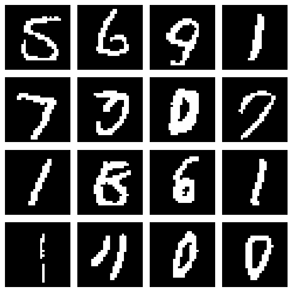

# UNetScoreNet
Данный проект представляет собой реализацию генеративной диффузионной модели на основе Noise Conditional Score Network (NCSN) для генерации изображений рукописных цифр из датасета MNIST.

# NCSN-MNIST: Генерация рукописных цифр с помощью Noise Conditional Score Networks

## О проекте

Данный проект реализует генеративную диффузионную модель на основе **Noise Conditional Score Network (NCSN)** для генерации изображений рукописных цифр из MNIST.

Модель обучается оценивать score-функцию (градиент логарифма плотности данных) и генерирует новые изображения с помощью динамики Ланжевена с контролируемым уменьшением шума (Annealed Langevin Dynamics).

## Теория

Проект основан на трёх ключевых работах в области score-based генеративного моделирования.

### 1. Hyvärinen (2005) — Score Matching

**Проблема:** Оценка параметров ненормированных моделей плотности, когда нормировочная константа Z(θ) невычислима.

**Решение:** Вместо оценки плотности минимизируется квадратичное расстояние между score-функциями.

**Ограничения:** Только для непрерывных данных, требуется гладкость плотности.

### 2. Vincent (2010) — Denoising Score Matching

**Проблема:** Score Matching требует вычисления вторых производных (гессиана).

**Решение:** Использование зашумленных данных позволяет упростить вычисления.

**Преимущества:** Не требует вторых производных, естественная регуляризация, простая реализация.

### 3. Song & Ermon (2019) — NCSN

**Проблемы:** Реальные данные лежат на низкоразмерных многообразиях (score не определён), плохое перемешивание динамики Ланжевена.

**Решение NCSN:**
- Возмущение данных шумом разных уровней {σ₁, ..., σ_L}
- Обучение одной условной сети s_θ(x, σ) для всех уровней
- Семплирование с помощью Annealed Langevin Dynamics

---

## Результаты

Вот как выглядят цифры, сгенерированные моделью после 15 эпох обучения:

*16 случайных цифр, сгенерированных с помощью Annealed Langevin Dynamics*
